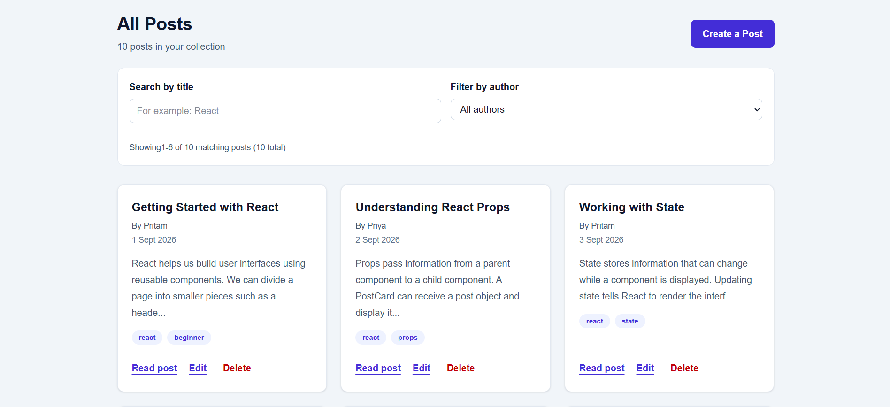
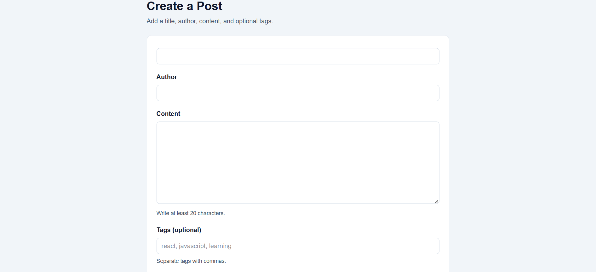
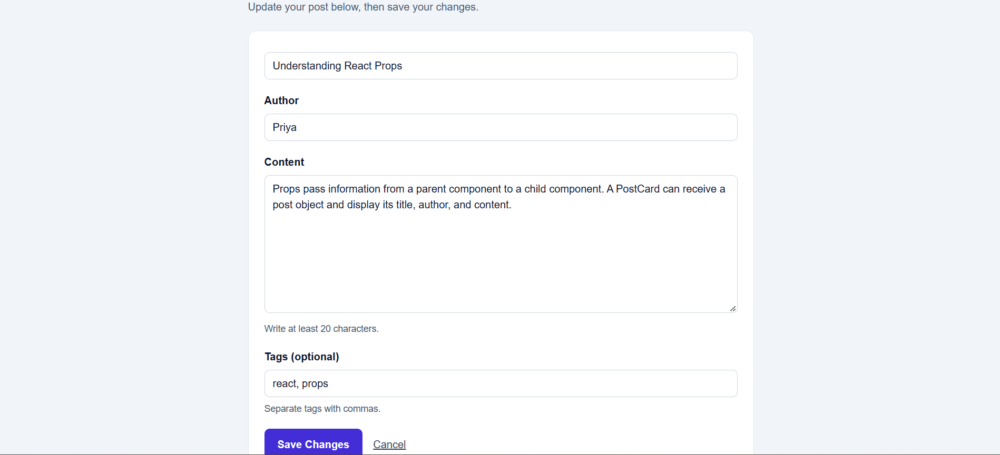
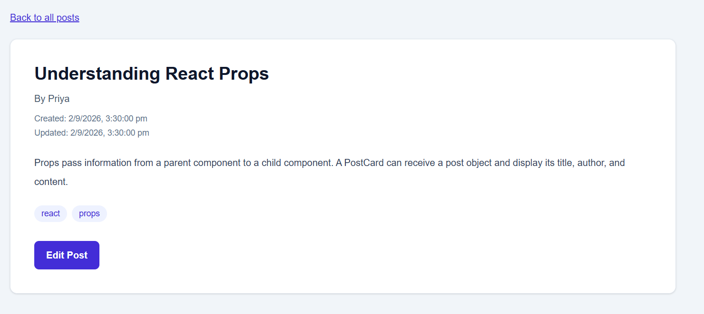
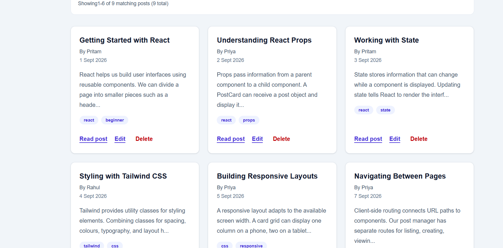
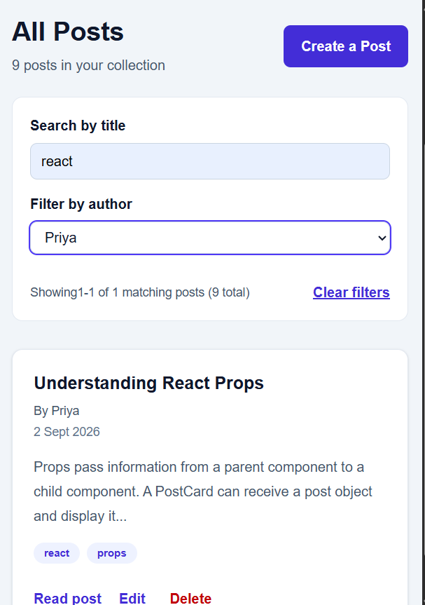

# Post Management

A small React application for creating and managing written posts. Posts are stored in the browser, so no account or server is required.

## Features

- Browse posts with title search and author filtering
- Navigate results with pagination
- Create, view, edit, and delete posts
- Add optional comma-separated tags
- Validate required fields and require at least 20 characters of post content
- Save posts in browser `localStorage` across reloads
- Start with sample posts on a browser's first visit

## Requirements

- Node.js 20.19+ or 22.12+
- npm

## Getting Started

From the project directory, install dependencies and start the development server:

```bash
npm install
npm run dev
```

Open the local URL printed by Vite in your browser.

## Available Commands

| Command | Description |
| --- | --- |
| `npm run dev` | Start the Vite development server |
| `npm run build` | Create a production build in `dist/` |
| `npm run preview` | Serve the production build locally |
| `npm run lint` | Run ESLint |

## Pages

| Route | Purpose |
| --- | --- |
| `/` | Browse, search, filter, and paginate posts |
| `/posts/new` | Create a post |
| `/posts/:id` | View a post |
| `/posts/:id/edit` | Edit a post |

## Data and Storage

The app uses `localStorage` in the current browser, under the `post-manager-posts` key. Data is not synchronized between browsers or devices and is cleared if the browser's site data is removed. Sample posts are shown when no saved post data exists.

## Built With

- React 19
- React Router
- Vite
- Tailwind CSS

## Screenshots







